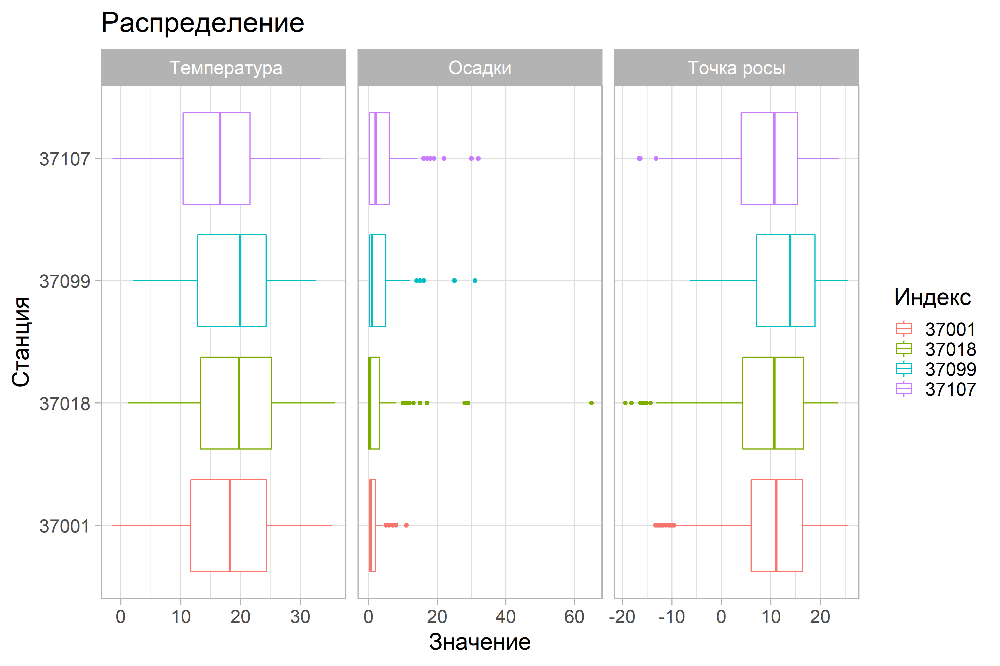

Как работает парсер с pogodaiklimat.ru
================
Всеволод Морейдо
8 сентября 2020 г

Скачать срочные (3 ч) данные (T, R, Td) с метеостанций в России и мире теперь проще
-----------------------------------------------------------------------------------

Все, что вам нужно - номера метеостанций и даты. Если в архиве ("Погоды и климата")\[<http://pogodaiklimat.ru>\] есть информация по этим станциям за эти даты, вы получите xlsx файлы со срочными и суточными значениями.

Пример
------

